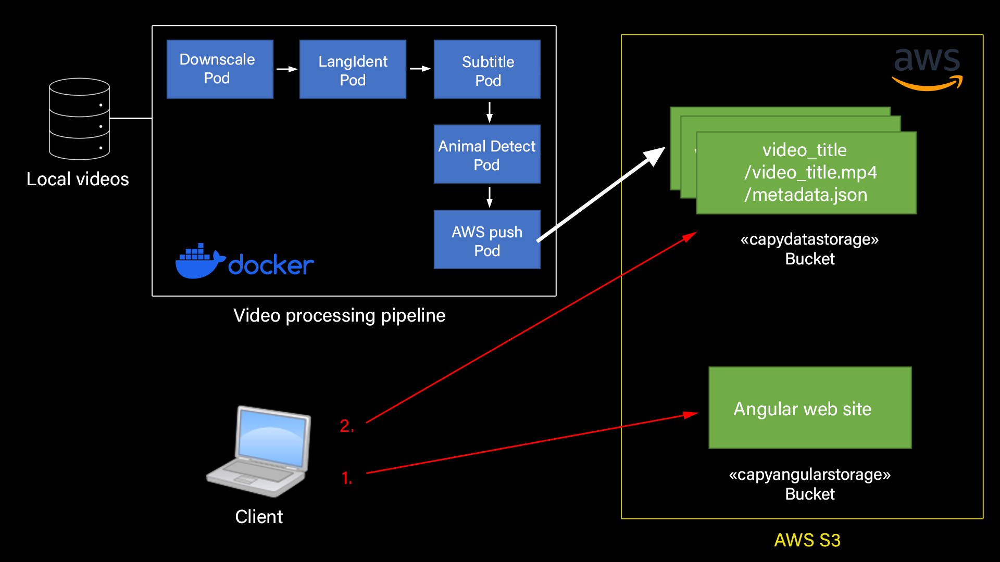

# ProjetCloud

Projet Cloud ESIR3 - Marine Hilliou, Théo Gravec, Thomas Benalouane, Zoé Costan

Une vidéo démonstration est disponible au lien suivant :
@TODO

# Description

## General

Le projet permet de traiter une vidéo :
- La vidéo est compressée
- La langue de la vidéo est détectée
- Les sous-titres corespondants sont ajoutés sur la vidéo
- Les animaux présents sur la vidéo sont détectés et affichés sur la vidéo

A partir d'une vidéo original, on créer alors :
- Une vidéo avec les sous-titres et la detection d'animaux 
- Un fichier JSON contenant les metadatas de la vidéo (langue, liste des animaux detectés)

Après traitement, ces données sont accessibles depuis un site web.

On retrouve alors sur le site web :
- Toutes les vidéos traités sur la page d'accueil
- La possibilité, pour chaque vidéo, de lire la vidéo traité et de visualiser les metadatas

## En détail

Notre projet suit l'infrastructure du schéma suivant :

1. La pipeline vidéo séléctionne d'abord la vidéo présente dans le dossier local spécifié.

2. Chaque vidéo passe dans la pipeline. Elle est compressée, les sous-titres, la langue et les animaux sont détectés.

3. Le dernier pod de la pipeline créer dans AWS S3 un bucket "capydatastorage" un dossier par vidéo.

4. Dans chaque dossier, il y a la vidéo transformée, et un fichier JSON contenant les metadatas de la vidéo.

5. Le deuxième bucket "capyangularstorage" contient le site web, développé en Angular.

6. Lorsque le client se connecte à son adresse, il récupère le site web.

7. Lorsque le site web s'affiche, il utilise aws-sdk pour récuperer tout le contenu du bucket "capydatastorage".

8. Il y extrait alors chaque dossier, et créer un onglet sur le front-end pour chaque dossier.

9. Lorsque le client clique sur un des onglets, Angular récupère le contenu du dossier associé dans le bucket, c'est à dire la vidéo et le JSON.

10. Enfin, il affiche la vidéo, extrait les metadatas contenues dans le JSON et les affiche.
    
# Deploiement

## Docker
@TODO
RUN ?????

## Site web

Le site web est disponible au lien suivant :
@TODO

# Détail de l'implémentation

## Compression

## Langue

## Sous-titres

## Detection d'animaux

## AWS Push

## AWS S3

## Angular
